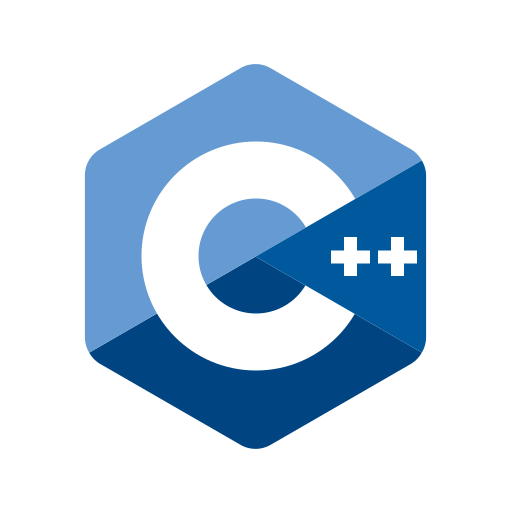
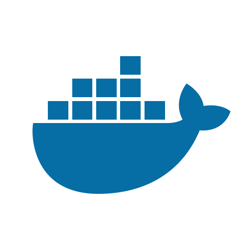
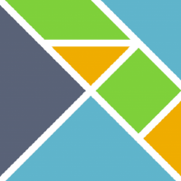
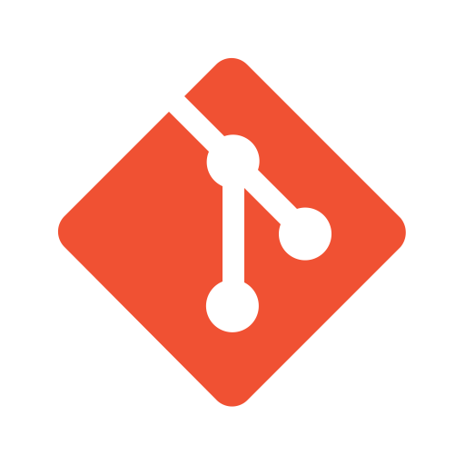
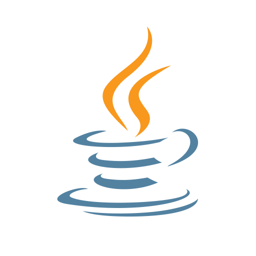
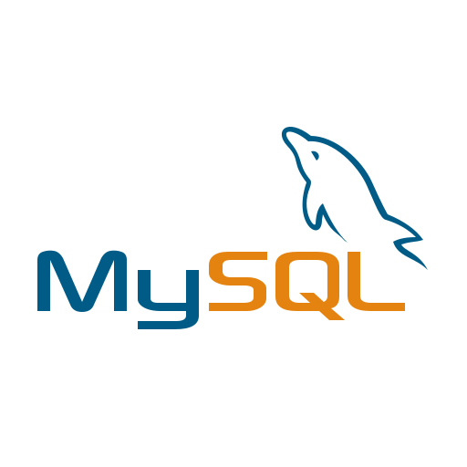
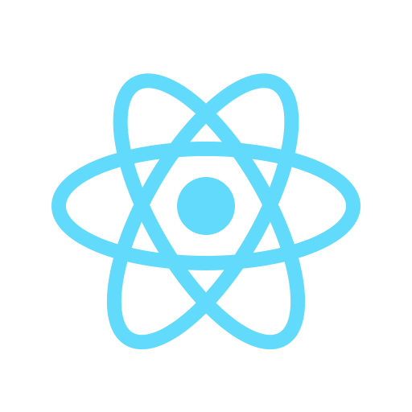

<h2 align="center">Hi 👋, I'm Robert Lisaru</h2>
<h3 align="center">A former Computer Science student in Sibiu, Romania.</h3>

- 🔭 I studied **programming** and **computer science** in highschool and at university, then I started working as a **software engineer**
- 🌱 We can talk about: **software architecture, coding tools, algorithms, data structures, functional programming, git, codegolf, clean code, design patterns, ux design, web development, frameworks, and more.**
- 📫 How to reach me: **lisaru.robert@gmail.com**

<h4 align="left">Languages and Tools:</h4>

 

 

 
 
 
 
 
 
 
 
 
 

 
 
 
 
 
 
 
 
 
 
 
 
 
 
 
 
 
 

<h4 align="left">GitHub stats (private repos may not count):</h4>

<h3 align="left">🐒 My fundamental masteries as a software engineer:</h3>

What is popular in the tech world changes constantly, but these are the fundamental masteries that I think will always make a software engineer valuable. [Why these? Why are they important?](https://gist.github.com/robertlisaru/66b648e8682c71954645949e01faf198)

<h4 align="left">I am inspired by:</h4>

 <a href="https://www.youtube.com/@CodeAesthetic" target="_blank" rel="noreferrer">  CodeAesthetic</a>
| <a href="https://www.youtube.com/@codinginflow" target="_blank" rel="noreferrer">  Coding in Flow</a>
| <a href="https://www.youtube.com/@Computerphile" target="_blank" rel="noreferrer">  Computerphile</a>
| <a href="https://www.youtube.com/watch?v=XpDsk374LDE" target="_blank" rel="noreferrer">  Evan Czaplicki</a>
| <a href="https://www.youtube.com/@Fireship" target="_blank" rel="noreferrer">  Fireship</a>
| <a href="https://www.youtube.com/@KevinPowell" target="_blank" rel="noreferrer">  Kevin Powell</a>
| <a href="https://www.youtube.com/@lexfridman" target="_blank" rel="noreferrer">  Lex Fridman</a>
| <a href="https://www.youtube.com/watch?v=DoA4Txr4GUs" target="_blank" rel="noreferrer">  Richard Feldman</a>
| <a href="https://www.youtube.com/@sibiuwebmeetup" target="_blank" rel="noreferrer">  Sibiu Web Meetup</a>
| <a href="https://www.youtube.com/@ThePrimeTimeagen" target="_blank" rel="noreferrer">  ThePrimeTime</a>
| <a href="https://www.youtube.com/@WebDevSimplified" target="_blank" rel="noreferrer">  Web Dev Simplified</a>
| and others.

<h4 align="left">Useful links and coding tools I found online:</h4>

[Best-websites-a-programmer-should-visit](https://github.com/sdmg15/Best-websites-a-programmer-should-visit)
| [CSS units flowchart](https://whatunit.com/)
| [docker prune](https://stackoverflow.com/questions/37518096/how-can-i-reduce-the-disk-space-used-by-docker)
| [draw.io](https://app.diagrams.net/)
| [elm patterns](https://sporto.github.io/elm-patterns/index.html)
| [flask.io](https://flask.io/)
| [flexbox froggy](https://flexboxfroggy.com/)
| [front-end-checklist](https://github.com/thedaviddias/Front-End-Checklist)
| [gitignore.io](https://www.gitignore.io)
| [google books ngram viewer](https://books.google.com/ngrams/graph?content=programmer%2Cmathematician&year_start=1800&year_end=2019&corpus=en-2019&smoothing=3)
| [html-to-elm](https://html-to-elm.com/)
| [kotlin vs java snippets](https://www.kotlinvsjava.com/)
| [radar chart creator](https://geographyfieldwork.com/RadarChartCreator.html)
| [regex](https://regex101.com/)
| [webkay.robinlinus.com](https://webkay.robinlinus.com/)
| [wolfram alpha](https://www.wolframalpha.com/)

<h4 align="left">Fun stuff, if you're bored:</h4>

[10 fast fingers](https://10fastfingers.com/typing-test/english)
| [dayssincelastjavascriptframework](https://dayssincelastjavascriptframework.com/)
| [devhumor](https://devhumor.com/)
| [grugbrain.dev](http://grugbrain.dev/)
| [isitthursday](http://isitthursday.org/)
| [itl.cat](https://www.itl.cat/)
| [midjourney](https://www.midjourney.com/showcase/recent/)

